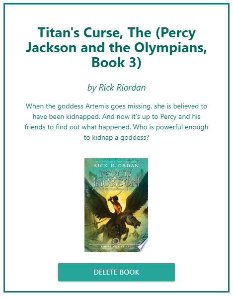

# Matt Books Pro

Matt Books Pro allows users to save entries from google books to later view or buy them. It will provide the name of the authors, a description of the book, and a picture of the cover which doubles as a link to its page on google books.

- - - - -
 
## Pages

You can navigate to the 'Search' page to find books you are interested.

Press the 'Save Book' button if you would like to view a book later.

By clicking on the 'Saved' link in the navigation bar you can view all books that you have saved.

Click on the 'Delete Book' button if you are no longer interested in tracking that book.